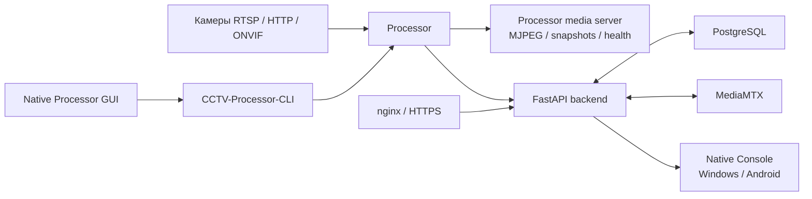
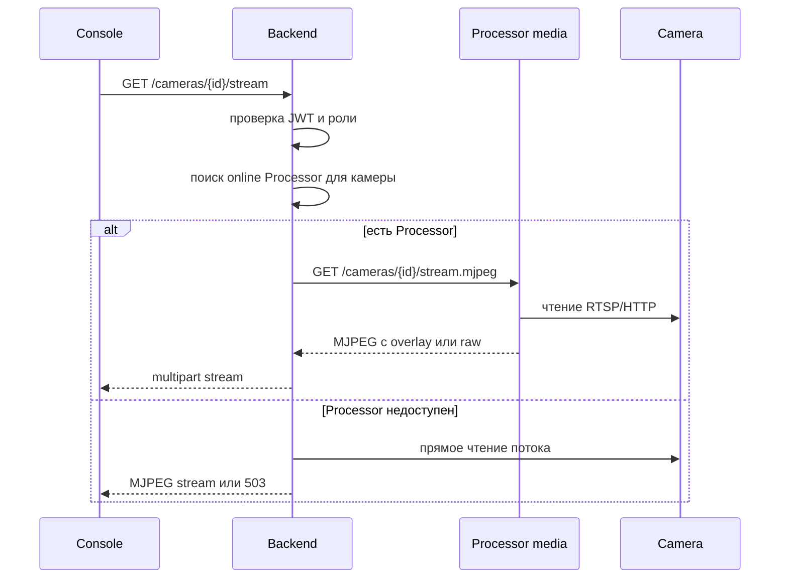
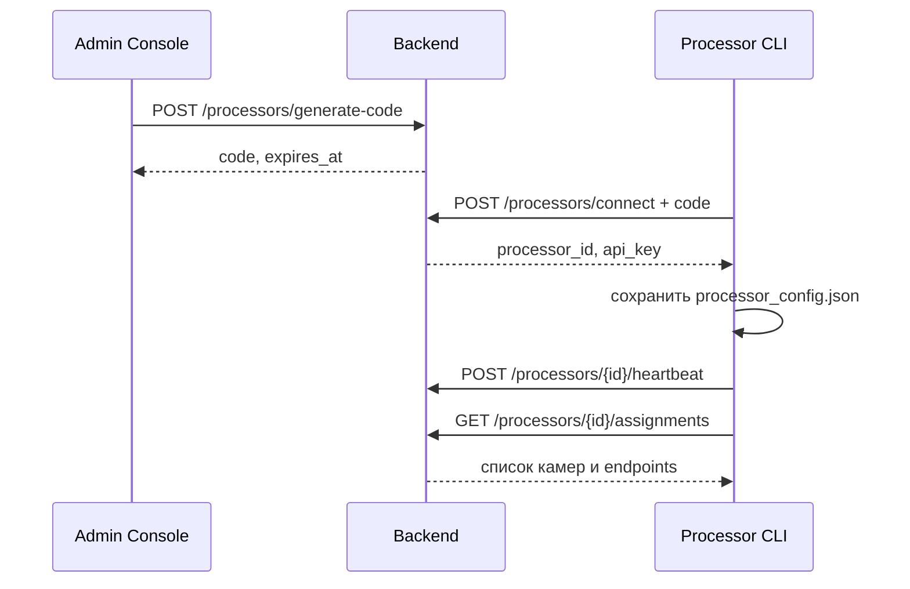
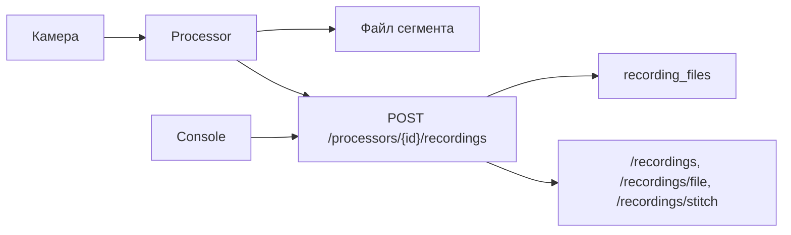
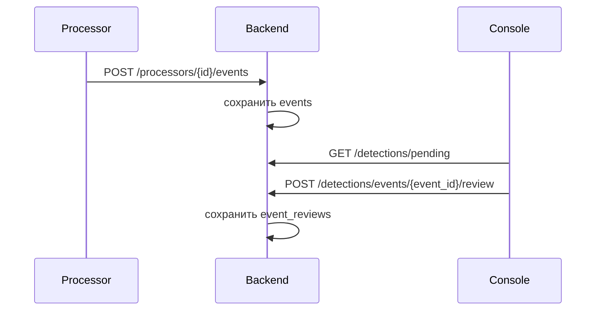

# CCTV Комплекс

`CCTV Комплекс` - система видеонаблюдения с центральным backend, нативной консолью оператора и отдельным локальным Processor. Backend хранит пользователей, роли, камеры, события, ревью, записи, отчеты и настройки Processor. Processor читает назначенные камеры, запускает распознавание лиц и людей, рисует overlay, ведет локальный media server и передает результаты в backend.

Проект рассчитан на рабочий стенд, где серверная часть может жить в Docker, а операторские и процессорные приложения запускаются как portable-сборки на Windows. Android-клиент использует тот же backend API.

## Возможности

- учетные записи, роли и TOTP;
- камеры RTSP/HTTP/ONVIF, группы, локации, endpoints, presets, ROI-зоны;
- live-просмотр напрямую с камеры или через Processor media server;
- overlay поверх потока: лица, люди, body detection, skeleton, треки;
- события, очередь ревью и отчеты;
- архив записей, выдача файлов и сборка фрагментов;
- Processor registration через код подключения;
- heartbeat, assignments и очередь команд для Processor;
- API-ключи для сервисных клиентов;
- Native Console на Flutter для Windows и Android;
- Native Processor GUI на Flutter для локального управления Python runtime;
- Docker-профили для backend, nginx, MediaMTX и Processor;
- production-настройки: проверка секретов, TrustedHost, CORS, security headers, закрытый OpenAPI по умолчанию.

## Структура репозитория

| Путь | Что внутри |
| --- | --- |
| `app/` | FastAPI backend, routers, схемы Pydantic, конфигурация, авторизация, права, отчеты, работа с Processor |
| `app/routers/` | HTTP API: auth, admin, cameras, recordings, processors, persons, detections, reports, api-keys, groups, system |
| `app/services/` | сервисная логика backend, включая ONVIF и работу с метаданными камер |
| `app/storage/` | вспомогательные модули для работы с файлами и хранилищем |
| `cctv_ai/` | общая AI-логика, runtime environment, ONNX Runtime, face/body inference |
| `processor/` | Python Processor: CLI, headless runtime, media server, обработка камер, сборка PyInstaller |
| `processor/systemd/` | шаблоны systemd для Linux-запуска Processor |
| `native/cctv_console/` | Flutter Native Console для Windows и Android |
| `native/cctv_processor_gui/` | Flutter GUI для локального управления Processor runtime |
| `migrations/` | Alembic-миграции PostgreSQL |
| `nginx/` | reverse proxy, HTTP/HTTPS-шаблоны и certbot webroot |
| `scripts/` | служебные скрипты для установки, логов, обслуживания и диагностики |
| `data/` | локальные runtime-данные для разработки |
| `docker-compose.yml` | единая схема Docker-сервисов и профилей |
| `.env.example` | пример конфигурации окружения |

## Общая схема работы



Backend является точкой управления. В нем создаются пользователи, камеры, персоны, назначения Processor, события и записи. Processor не требует ручного дублирования конфигурации камер: после подключения к backend он получает assignments через API. Если администратор назначил новую камеру, backend ставит команду `reload_assignments`, а Processor забирает ее в своем poll loop.

## Live pipeline

Live может идти двумя путями. Если камера не назначена на online Processor, backend пробует открыть поток камеры напрямую. Если камера назначена на Processor, backend проксирует Processor media endpoint. Это позволяет показывать overlay и не держать тяжелую обработку в backend.



Практический смысл такой: задержку нужно искать по участкам. Сначала камера и RTSP, потом MediaMTX, затем backend proxy, Processor overlay и только после этого Flutter/Web render.

## Подключение Processor

Processor подключается через короткий код. Администратор генерирует код в Console или через API, Processor меняет его на постоянный API-ключ и сохраняет настройки в `processor_config.json`.



После этого GUI Processor показывает статус backend, CPU/RAM/GPU, назначенные камеры и сервисные действия. GUI управляет готовым Python runtime, а не заменяет его.

## Данные и таблицы

Основная БД - PostgreSQL. Alembic создает схему из `migrations/`, модели описаны в `app/models.py`. Ниже не полный SQL-словарь, а рабочая карта таблиц, чтобы было понятно, где искать данные.

| Группа | Таблицы | Назначение |
| --- | --- | --- |
| Пользователи и доступ | `roles`, `users`, `user_mfa_methods`, `auth_events`, `api_keys` | роли, учетные записи, TOTP, события входа, сервисные ключи |
| Камеры | `groups`, `cameras`, `camera_endpoints`, `video_streams`, `camera_presets`, `camera_roi_zones` | камеры, локации, endpoints, ONVIF/PTZ, presets, ROI-зоны |
| Processor | `processors`, `processor_connection_codes`, `processor_camera_assignments`, `processor_commands` | регистрация, коды подключения, назначения камер, очередь команд |
| Распознавание | `person_categories`, `persons`, `person_embeddings` | персоны и embeddings для распознавания в видеопотоке |
| События и ревью | `event_types`, `events`, `event_reviews` | события от Processor, ручная проверка, статусы ревью |
| Записи | `storage_targets`, `recording_files` | файлы архива, время записи, размер, путь, привязка к камере и Processor |
| Уведомления и аудит | `notifications`, `notification_deliveries`, `notification_preferences`, `push_subscriptions`, `audit_log` | доставка уведомлений, настройки, аудит изменений |

В API используются Pydantic-схемы из `app/schemas/`. Они отделяют внешний контракт от SQLAlchemy-моделей. Это важно для камер и Processor: backend может хранить секреты и внутренние поля, но клиент получает только безопасное представление.

## API-зоны

| Prefix | Кто использует | Что делает |
| --- | --- | --- |
| `/auth` | Console, web | вход, профиль, смена пароля, TOTP, media token |
| `/admin` | администратор | пользователи, камеры, ONVIF, PTZ, служебные CRUD-операции |
| `/cameras` | Console, web | список камер, права, live stream, snapshot |
| `/recordings` | Console, web | список записей, выдача файлов, MJPEG, stitched archive |
| `/detections` | Console, Processor | события, pending review, review actions, timeline |
| `/persons` | Console, web | персоны и embeddings |
| `/processors` | Processor, администратор | connect, register, heartbeat, assignments, команды, gallery |
| `/reports` | Console, web | dashboard, отчеты, экспорт |
| `/api-keys` | администратор | сервисные ключи и scopes |
| `/groups` | администратор | группы камер |
| `/system` | Console, web | изменения и служебное состояние |

В production OpenAPI отключен, если `ENABLE_DOCS=false`. Это нормальный режим для стенда, где backend доступен в сети.

## Роли

| Роль | `role_id` | Доступ к live | Управление камерами | Администрирование |
| --- | ---: | --- | --- | --- |
| Администратор | `1` | да | да | да |
| Пользователь | `2` | да | управление в рамках рабочих функций | нет |
| Смотрящий | `3` | да | нет | нет |

Собственную роль менять нельзя. Это проверяется backend-ом на уровне `/admin/users/{user_id}/role`.

## Docker-сервисы и профили

| Сервис | Роль | Профили |
| --- | --- | --- |
| `db` | PostgreSQL | `core`, `server`, `server-cpu`, `server-gpu`, `gpu-nvidia` |
| `backend` | FastAPI API и встроенная server-side web-раздача | `core`, `server`, `server-cpu`, `server-gpu`, `gpu-nvidia` |
| `mediamtx` | RTSP/RTMP/HLS media service | `core`, `server`, `server-cpu`, `server-gpu`, `gpu-nvidia` |
| `nginx` | reverse proxy и HTTP/HTTPS вход | `with-nginx`, `public` |
| `certbot` | продление Let's Encrypt | `with-nginx`, `public` |
| `processor` | CPU/auto Processor в контейнере | `with-processor`, `server-cpu` |
| `processor-nvidia` | NVIDIA Processor в контейнере | `with-gpu`, `processor-nvidia`, `server-gpu`, `gpu-nvidia` |

По умолчанию PostgreSQL не публикуется наружу. MediaMTX привязан к `127.0.0.1`, если не изменить `MEDIAMTX_BIND`. Backend публикуется через `BACKEND_BIND` и `BACKEND_PORT`.

## Порты

| Назначение | Переменная | Значение в `.env.example` |
| --- | --- | --- |
| Backend снаружи | `BACKEND_PORT` | `8000` |
| Backend bind address | `BACKEND_BIND` | `127.0.0.1` |
| nginx HTTP | `NGINX_HTTP_PORT` | `80` |
| nginx HTTPS | `NGINX_HTTPS_PORT` | `443` |
| MediaMTX RTSP | `MEDIAMTX_RTSP_PORT` | `8554` |
| MediaMTX RTMP | `MEDIAMTX_RTMP_PORT` | `1935` |
| MediaMTX HLS | `MEDIAMTX_HLS_PORT` | `8888` |
| Processor media | `PROCESSOR_MEDIA_PORT` | `8777` |

На рабочем Windows-стенде часто используется `BACKEND_PORT=8001`, поэтому локальный backend доступен как `http://127.0.0.1:8001`.

## Быстрый запуск

Основной способ запуска на Windows:

```powershell
.\scripts\cctv-up.ps1 -Profile server
```

Скрипт делает то, что обычно приходилось настраивать руками: создает `.env` из `.env.example`, генерирует `POSTGRES_PASSWORD`, `JWT_SECRET`, `PROCESSOR_API_KEY`, `TOTP_ENCRYPTION_KEY`, `PROCESSOR_MEDIA_TOKEN` и первичный `BOOTSTRAP_ADMIN_PASSWORD`, поднимает выбранный Docker-профиль и в конце показывает полезные адреса:

- backend внутри Docker: `http://backend:8000`;
- backend на сервере: `http://127.0.0.1:<BACKEND_PORT>`;
- backend в локальной сети, если включен LAN bind;
- логин и пароль администратора для чистой БД.

Если Docker Desktop еще не установлен:

```powershell
.\scripts\cctv-up.ps1 -Profile server -InstallDocker
```

После установки Docker Desktop нужно запустить его, дождаться готовности движка и повторить запуск.

Доступные профили:

| Команда | Что поднимает |
| --- | --- |
| `.\scripts\cctv-up.ps1 -Profile core` | PostgreSQL, backend, MediaMTX |
| `.\scripts\cctv-up.ps1 -Profile server` | backend, MediaMTX |
| `.\scripts\cctv-up.ps1 -Profile server-cpu` | сервер и Docker Processor на CPU/auto |
| `.\scripts\cctv-up.ps1 -Profile server-gpu` | сервер и Docker Processor с NVIDIA |
| `.\scripts\cctv-up.ps1 -Profile public -Domain cctv.example.com -Email admin@example.com -IssueCertificate` | сервер, nginx, первичный сертификат Let's Encrypt и автопродление через certbot |

Для обычного LAN-стенда backend публикуется на `0.0.0.0:<BACKEND_PORT>`, поэтому Native Console на телефоне может подключаться к адресу вида `http://192.168.x.x:8001`. Для режима с nginx/public backend по умолчанию закрывается на `127.0.0.1`, а внешний вход идет через nginx. Если прямой LAN-доступ к backend все равно нужен, добавьте `-ExposeBackend`.

`BOOTSTRAP_ADMIN_LOGIN` и `BOOTSTRAP_ADMIN_PASSWORD` применяются только при первой инициализации пустой БД. Если БД уже создана, изменение этих значений в `.env` не меняет пароль существующего администратора.

Ручной запуск через Docker Compose тоже остается доступен. Для него сначала создайте `.env` и задайте секреты:

```powershell
Copy-Item .env.example .env
```

Для стенда, доступного из сети, выставляйте `ENVIRONMENT=production`, задавайте сильные `JWT_SECRET`, `POSTGRES_PASSWORD`, `PROCESSOR_API_KEY`, `TOTP_ENCRYPTION_KEY`, `BOOTSTRAP_ADMIN_PASSWORD`, а `ALLOW_DEFAULT_ADMIN` переводите в `false`.

Минимальный сервер:

```powershell
docker compose --profile core up -d --build backend mediamtx
```

Обычный сервер:

```powershell
docker compose --profile server up -d --build
```

Сервер с nginx:

```powershell
docker compose --profile server --profile public up -d --build
```

Сервер с Docker Processor на CPU:

```powershell
docker compose --profile server-cpu up -d --build
```

Сервер с NVIDIA Processor:

```powershell
docker compose --profile server-gpu up -d --build
```

Проверка:

```powershell
docker compose ps
Invoke-WebRequest http://127.0.0.1:8000/health
Invoke-WebRequest http://127.0.0.1:8000/health/db
```

Если в `.env` указан `BACKEND_PORT=8001`, используйте `http://127.0.0.1:8001`.

## Первый запуск с нуля

1. Поднимите `db`, `backend`, `mediamtx`, при необходимости `nginx`.
2. Откройте Native Console или используйте backend API.
3. Войдите под `BOOTSTRAP_ADMIN_LOGIN` и `BOOTSTRAP_ADMIN_PASSWORD`.
4. Создайте камеры. Для RTSP укажите основной поток в `stream_url` или через endpoint `rtsp`.
5. Откройте раздел Processor и создайте код подключения.
6. На машине Processor выполните подключение через CLI или GUI.
7. Назначьте камеры на Processor.
8. Проверьте `/processors`, `/cameras`, live stream и archive.

CLI-подключение Processor:

```powershell
& "$env:USERPROFILE\Desktop\CCTV Processor Flutter portable\processor\CCTV-Processor-CLI.exe" connect `
  --backend-url http://127.0.0.1:8001 `
  --code ABCD1234 `
  --name SUKHOI `
  --processor-accel nvidia `
  --json
```

Проверка состояния:

```powershell
& "$env:USERPROFILE\Desktop\CCTV Processor Flutter portable\processor\CCTV-Processor-CLI.exe" status --json
& "$env:USERPROFILE\Desktop\CCTV Processor Flutter portable\processor\CCTV-Processor-CLI.exe" assignments --json
```

## Конфигурация

Главный файл настроек - `.env`. Таблица ниже покрывает переменные, которые чаще всего приходится менять руками или через Setup в Console.

| Переменная | Что задает |
| --- | --- |
| `DOMAIN` | домен для nginx и Let's Encrypt |
| `SSL_EMAIL` | email для certbot |
| `BACKEND_BIND`, `BACKEND_PORT` | адрес и порт публикации backend |
| `NGINX_HTTP_PORT`, `NGINX_HTTPS_PORT` | порты nginx |
| `NGINX_HTTPS_ENABLED` | включает HTTPS-конфигурацию nginx |
| `ENVIRONMENT` | `development` или `production` |
| `POSTGRES_USER`, `POSTGRES_PASSWORD`, `POSTGRES_DB` | настройки PostgreSQL |
| `JWT_SECRET` | подпись access token |
| `TOTP_ENCRYPTION_KEY` | ключ шифрования TOTP и секретов камер |
| `BOOTSTRAP_ADMIN_LOGIN`, `BOOTSTRAP_ADMIN_PASSWORD` | первичный администратор |
| `ALLOW_DEFAULT_ADMIN` | разрешение создать `admin/admin` в dev-режиме |
| `CORS_ORIGINS`, `ALLOWED_HOSTS` | разрешенные origins и host headers |
| `ENABLE_DOCS` | включает `/docs`, `/redoc`, `/openapi.json` |
| `MEDIA_TOKEN_EXPIRES_SECONDS` | срок жизни media token |
| `PROCESSOR_NAME`, `PROCESSOR_NODE_UID` | имя и стабильный идентификатор Processor |
| `PROCESSOR_POLL_INTERVAL` | как часто Processor забирает assignments и команды |
| `PROCESSOR_HEARTBEAT_INTERVAL` | как часто Processor отправляет heartbeat |
| `PROCESSOR_MEDIA_BIND`, `PROCESSOR_MEDIA_PORT` | публикация Processor media server |
| `PROCESSOR_ACCEL` | `auto`, `cpu`, `nvidia`, `intel`, `amd`, `directml` |
| `FACE_SCAN_DIVISOR` | частота face inference относительно кадров |
| `OVERLAY_FRAME_DIVISOR` | частота генерации overlay |
| `RECORDING_SEGMENT_SECONDS` | длина сегмента записи |
| `RECORDINGS_PATH`, `SNAPSHOTS_PATH` | пути к файлам записей и снимков |

В production backend проверяет опасные настройки при старте. Он не должен запускаться с пустым `JWT_SECRET`, пустым `TOTP_ENCRYPTION_KEY`, wildcard CORS/hosts или дефолтным admin без явного разрешения.

## Nginx, домен и сертификаты

Nginx нужен, когда backend и web надо открыть через один домен. В текущей схеме:

- `/health` идет в backend;
- API-префиксы идут в backend;
- корневой web-маршрут возвращает `404`;
- `/.well-known/acme-challenge/` отдается certbot webroot;
- HTTPS включается через `NGINX_HTTPS_ENABLED=true`.

Для домена задайте в `.env`:

```env
DOMAIN=cctv.example.com
SSL_EMAIL=admin@example.com
NGINX_HTTPS_ENABLED=true
```

Первичный выпуск сертификата выполняется отдельным bootstrap-скриптом:

```powershell
.\init-ssl.sh
```

Дальше `certbot` в Docker-профиле `public` пробует продлевать сертификаты каждые 12 часов. Продление работает, пока домен указывает на этот сервер и HTTP challenge доступен снаружи.

## Processor и GPU

Processor может работать из Docker или как portable runtime. На Windows основной рабочий вариант - portable:

```text
%USERPROFILE%\Desktop\CCTV Processor Flutter portable\
  cctv_processor_gui.exe
  processor\
    CCTV-Processor-CLI.exe
    CCTV-Processor-Runtime.exe
    processor_config.json
```

`processor_config.json` создается и обновляется через подключение к backend. Вручную его обычно не редактируют.

Диагностика GPU:

```powershell
& "$env:USERPROFILE\Desktop\CCTV Processor Flutter portable\processor\CCTV-Processor-CLI.exe" acceleration --json
```

Для NVIDIA-стенда нормальный результат:

```json
{
  "selected_device": "cuda",
  "selected_provider": "CUDAExecutionProvider"
}
```

Если виден только CPU, проверьте пакет:

```powershell
py -3.11 -m pip show onnxruntime-gpu
py -3.11 -c "import onnxruntime as ort; print(ort.get_available_providers())"
```

Установка GPU runtime:

```powershell
py -3.11 -m pip uninstall -y onnxruntime
py -3.11 -m pip install "onnxruntime-gpu>=1.18.1,<1.24"
```

## Сборка Processor runtime

Headless runtime:

```powershell
$env:SKIP_PROCESSOR_CLI='1'
py -3.11 processor\build_exe.py
```

CLI:

```powershell
py -3.11 -c "from processor.build_exe import _run, _cli_cmd; _run(_cli_cmd())"
```

Артефакты:

```text
processor\dist\CCTV-Processor\
processor\dist\CCTV-Processor-CLI.exe
```

Для portable-сборки содержимое `processor\dist\CCTV-Processor\*` кладется в:

```text
%USERPROFILE%\Desktop\CCTV Processor Flutter portable\processor\
```

А `processor\dist\CCTV-Processor-CLI.exe` копируется как:

```text
%USERPROFILE%\Desktop\CCTV Processor Flutter portable\processor\CCTV-Processor-CLI.exe
```

## Native Console

Исходники:

```text
native\cctv_console\
```

Проверки:

```powershell
cd native\cctv_console
flutter test
dart analyze lib test
```

Из-за кириллицы в пути Windows-сборку лучше делать через ASCII temp:

```powershell
$src = "C:\Users\dsok8\Desktop\CCTV Комплекс\native\cctv_console"
$tmp = Join-Path $env:TEMP "cctv_console_build"
Remove-Item $tmp -Recurse -Force -ErrorAction SilentlyContinue
robocopy $src $tmp /E /XD build .dart_tool .gradle ephemeral
cd $tmp
flutter build windows --release
flutter build apk --release --target-platform android-arm64 --split-per-abi
```

Portable Windows:

```text
%USERPROFILE%\Desktop\CCTV Console Flutter portable\
```

Android APK:

```text
%USERPROFILE%\Desktop\CCTV Console Android\cctv-console-arm64-v8a-release.apk
```

Установка на подключенный телефон:

```powershell
adb devices
adb -s <serial> install -r "$env:USERPROFILE\Desktop\CCTV Console Android\cctv-console-arm64-v8a-release.apk"
adb -s <serial> shell am start -n ru.cctv.cctv_console/.MainActivity
```

## Native Processor GUI

Исходники:

```text
native\cctv_processor_gui\
```

Проверки:

```powershell
cd native\cctv_processor_gui
flutter test
dart analyze lib test
```

Сборка Windows:

```powershell
$src = "C:\Users\dsok8\Desktop\CCTV Комплекс\native\cctv_processor_gui"
$tmp = Join-Path $env:TEMP "cctv_processor_gui_build"
Remove-Item $tmp -Recurse -Force -ErrorAction SilentlyContinue
robocopy $src $tmp /E /XD build .dart_tool .gradle ephemeral
cd $tmp
flutter build windows --release
```

Результат копируется в:

```text
%USERPROFILE%\Desktop\CCTV Processor Flutter portable\
```

Папку `processor` внутри portable не удаляют: там лежит Python runtime, CLI, модели, конфиг и media-директории.

## Локальная разработка backend

Backend:

```powershell
py -3.11 -m venv .venv
.\.venv\Scripts\python.exe -m pip install -r requirements.txt
.\.venv\Scripts\alembic.exe upgrade head
.\.venv\Scripts\uvicorn.exe app.main:app --reload --host 0.0.0.0 --port 8000
```

Processor в dev-режиме:

```powershell
py -3.11 -m processor.cli acceleration --json
py -3.11 -m processor.cli run
```

## Записи

Processor пишет записи сегментами. Backend хранит метаданные в `recording_files`, а файлы лежат в volume или локальном каталоге. Для пользователя это выглядит как единый архив:



Если запись хранится рядом с Processor, backend выдает ее через Processor media path или через зарегистрированный file endpoint. Для длинного просмотра backend может собрать несколько фрагментов в один ответ.

## События и ревью

События приходят от Processor через `/processors/{id}/events`. Они могут ссылаться на камеру, персону, track id, confidence и snapshot. Неразобранные события попадают в pending review. Оператор подтверждает или отклоняет событие, после чего backend сохраняет результат в `event_reviews`.



## PTZ

PTZ-команды идут через backend. Для continuous move должен быть timeout, потому что камера не должна ехать бесконечно, если клиент не отправил stop. Клиентам стоит использовать deadzone и throttling, чтобы не слать поток микрокоманд.

Основные endpoints:

| Endpoint | Назначение |
| --- | --- |
| `POST /admin/cameras/{id}/onvif/ptz/relative` | относительное движение |
| `POST /admin/cameras/{id}/onvif/ptz/continuous` | continuous move с timeout |
| `POST /admin/cameras/{id}/onvif/ptz/absolute` | абсолютная позиция |
| `POST /admin/cameras/{id}/onvif/ptz/home` | переход домой |
| `POST /admin/cameras/{id}/onvif/ptz/stop` | остановка |

## Проверки перед выпуском

Backend:

```powershell
py -3.11 -m compileall app processor cctv_ai
docker compose --profile core up -d --build backend
docker compose ps
docker logs --tail 100 cctv-backend-1
Invoke-WebRequest http://127.0.0.1:8001/health
```

Native Console:

```powershell
cd native\cctv_console
flutter test
dart analyze lib test
flutter build apk --release --target-platform android-arm64 --split-per-abi
```

Native Processor GUI:

```powershell
cd native\cctv_processor_gui
flutter test
dart analyze lib test
flutter build windows --release
```

Processor:

```powershell
& "$env:USERPROFILE\Desktop\CCTV Processor Flutter portable\processor\CCTV-Processor-CLI.exe" acceleration --json
& "$env:USERPROFILE\Desktop\CCTV Processor Flutter portable\processor\CCTV-Processor-CLI.exe" status --json
```

Для UI-проверок смотрите реальные размеры окна Windows и Android portrait. Особенно это важно для Live, Записей, Ревью, Отчетов, Processor, API-ключей, Камер, Персон и Пользователей.

## Security notes

Для стенда в сети:

- публикуйте наружу backend или nginx, а не PostgreSQL;
- не открывайте `5432` в LAN или Internet;
- держите MediaMTX на `127.0.0.1`, если нет отдельной авторизации и firewall;
- включайте `ENVIRONMENT=production`;
- задавайте сильные секреты;
- заполняйте `TOTP_ENCRYPTION_KEY`;
- не используйте `CORS_ORIGINS=["*"]` и `ALLOWED_HOSTS=["*"]`;
- держите OpenAPI выключенным снаружи;
- используйте HTTPS через nginx;
- проверяйте контейнеры после обновления зависимостей.

Backend container запускается не от root, с `read_only`, `tmpfs`, `cap_drop: ALL` и `no-new-privileges`. Для MediaMTX в compose также задан non-root user и ограниченные capabilities.

## Диагностика

| Симптом | Что проверить |
| --- | --- |
| Backend не отвечает | `docker compose ps`, `docker logs --tail 100 cctv-backend-1`, `/health` |
| БД не готова | healthcheck `db`, переменные `POSTGRES_*`, Alembic-логи |
| Console не входит | backend URL, пароль, TOTP, `auth_events`, CORS/hosts |
| Viewer не видит Live | роль `3`, `/cameras`, `/cameras/{id}/permission` |
| Processor не появляется | код подключения, `processor_config.json`, `/processors`, CLI `status --json` |
| Назначения не доходят | `/processors/{id}/assignments`, команда `reload_assignments`, poll interval |
| Live без overlay тормозит | RTSP transport, камера, MediaMTX, backend proxy, player |
| Overlay сильно запаздывает | GPU provider, очередь кадров, `FACE_SCAN_DIVISOR`, `OVERLAY_FRAME_DIVISOR` |
| Snapshot/stream 503 | доступность камеры, Processor media `/health`, порт `8777`, firewall |
| GPU не используется | `acceleration --json`, `onnxruntime-gpu`, `CUDAExecutionProvider` |

## Как читать схемы в README

Схемы написаны в Mermaid. GitHub отрисовывает их прямо в README. Если редактор Mermaid не поддерживает, блоки остаются обычным текстом, но порядок узлов и стрелок все равно читается.

Таблицы в README не заменяют код и миграции. Они нужны как карта проекта: где лежит модуль, какая таблица за что отвечает, какой endpoint вызывает клиент. Если поведение непонятно, первым делом смотрите соответствующий router в `app/routers/`, затем Pydantic-схему в `app/schemas/`, потом SQLAlchemy-модель в `app/models.py`.

## Рабочий порядок изменений

1. Проверьте статус репозитория.
2. Найдите владельца поведения через `rg`.
3. Внесите узкую правку.
4. Запустите форматирование и тесты для затронутой части.
5. Пересоберите Docker или portable-артефакт, если менялся backend, Processor или Flutter.
6. Проверьте функциональный путь, а не только сборку.
7. Обновите README, если изменились команды, порты, роли, профили или схема данных.

Так README остается рабочим документом, а не отдельной инструкцией, которая живет сама по себе.
